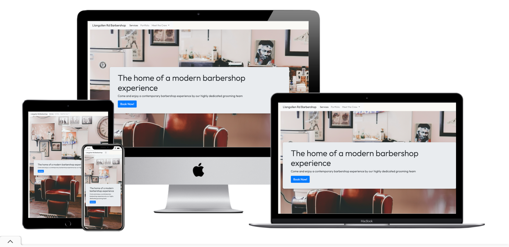
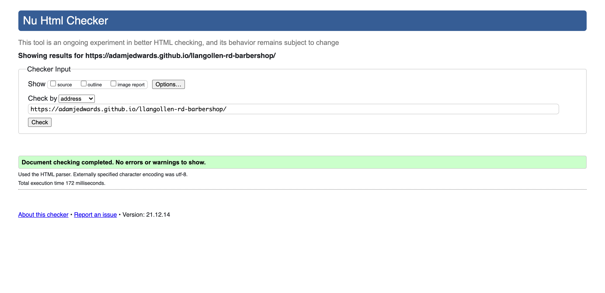
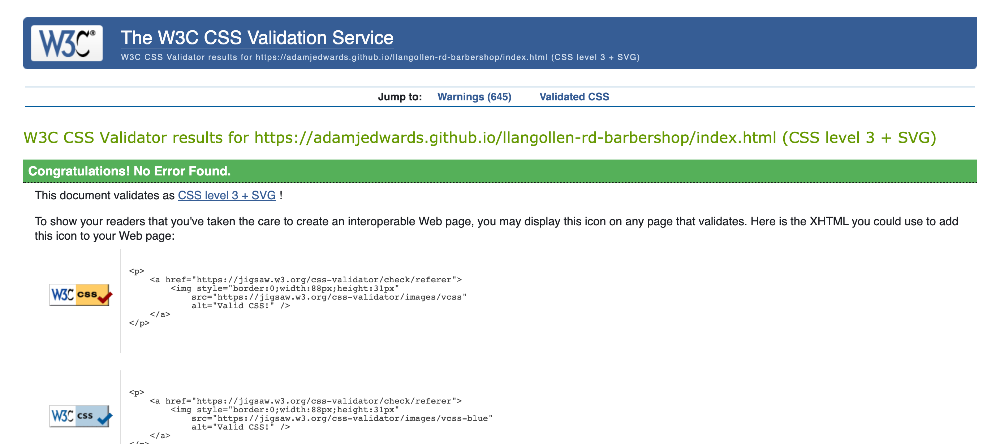
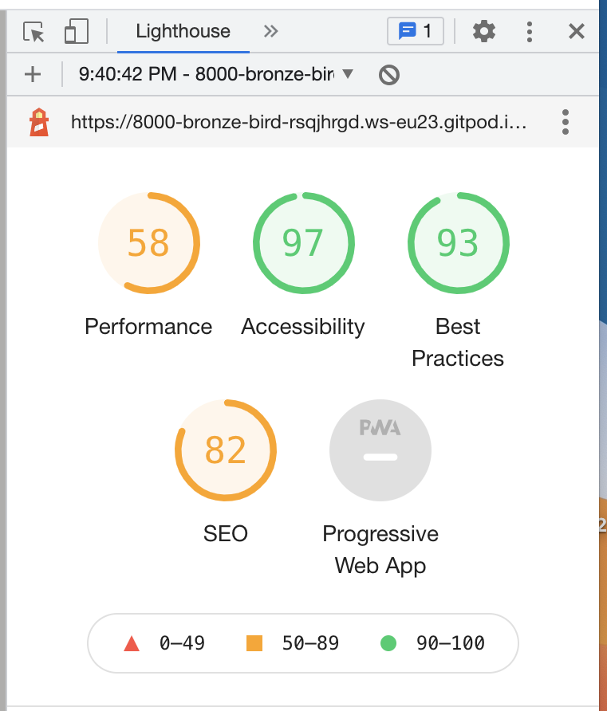
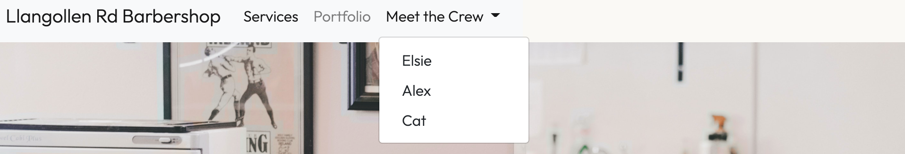
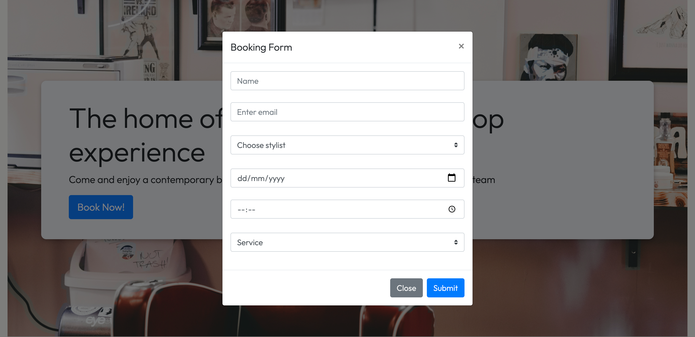
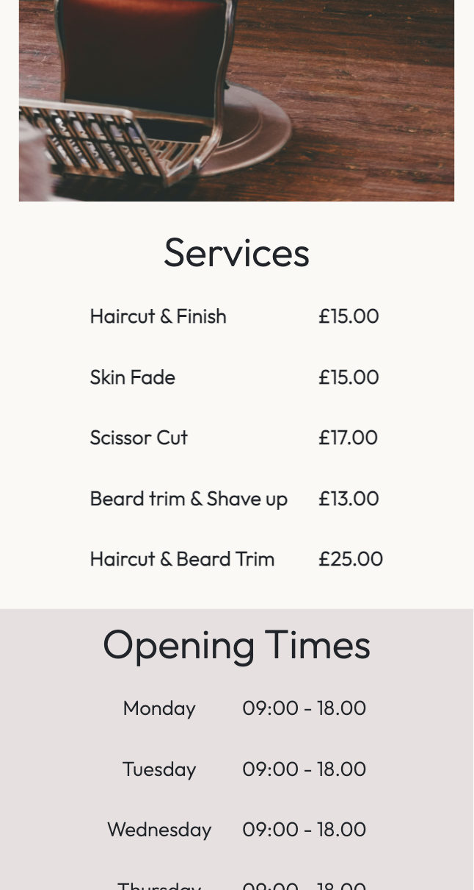
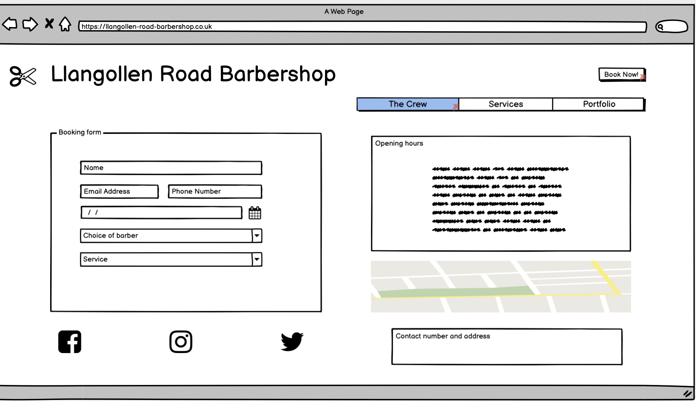
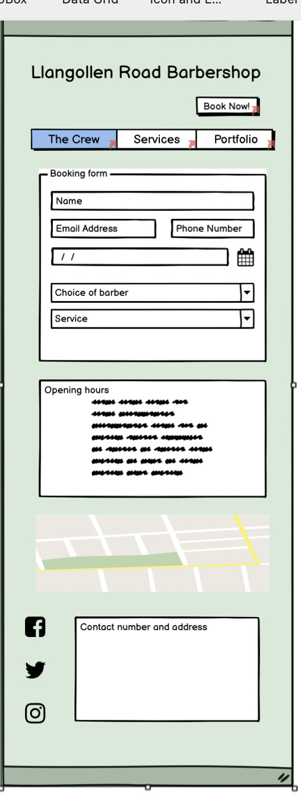

# Llangollen Road Barbershop
Sitting the chair of my local barbershop I was telling the concept of the code institue course, he explained to me the lack of web presence his shop has which led me to the idea of designing a webpage for a barbershop.

The site will contain a booking form, a list of services that the barbershop will provide along with a pricelist. a portfolio of images from the barbers clients and a page that introduces each of the members of staff. 

The site will have a minimalist style with neutral colour scheme, I used http://colormind.io/bootstrap/ to chose my color scheme. 

Final Webpage design (https://adamjedwards.github.io/llangollen-rd-barbershop/)

# Webpage Vaildation and Testing

Manual testing was done by checking each feature in a preview browser before pushing to githib. 

# Features

* navbar

When landing on the webpage you will be introduced to a navbar which will include links to the home page, service, portfolio and each of the members of staff. 

Added "position: fixed;" to navbar to improve navigation around the webpage. without a fixed navbar it felt as if there was too much scrolling to get around the site. 

* Landing image

The background image will include an overlay jumbotron imported using bootstrap, here is where you can book your appointment. 

* Services

As you scroll down (or click Services tab) you will come across the services section. here you can see a pricelist and an explaination of each type of cut. When hovering over each service it will highlight across the table to make it more readable. 

Changed the colour of the booking form button to match the colour of the barbers bio so the colour scheme is coherent throughout the page. 

When viewing on a mobile platform the description will not be displayed to make it more readable. 

* Crew member page

Had problems with horizontal alignment of image and barber bio, could not be viewed on mobile without side scrolling. implemented flex-wrap so image and text is vertically stacked on mobile platform. 

* Footer

The footer will include external links to facebook, instagram and twitter, each link will open a new tab when opened. 

# Wireframes

 
 

As you can see I have changed my design from wireframe to live page. I think it was more user friendly and more intuitive to the user to use a modal function instead of on a separate page to access the booking form.

# Resources 

* To develop the site I used https://bootstrap.com v4.1 to set out the layout for each of the webpages.

* All images to used from https://pexels.com

* scissor image was imported from https://fontawesome.com/ 

* CSS box-shadow used from https://getcssscan.com/css-box-shadow-examples

* Footer template from https://www.web-eau.net/blog/10-best-footer-html-css-snippets 

